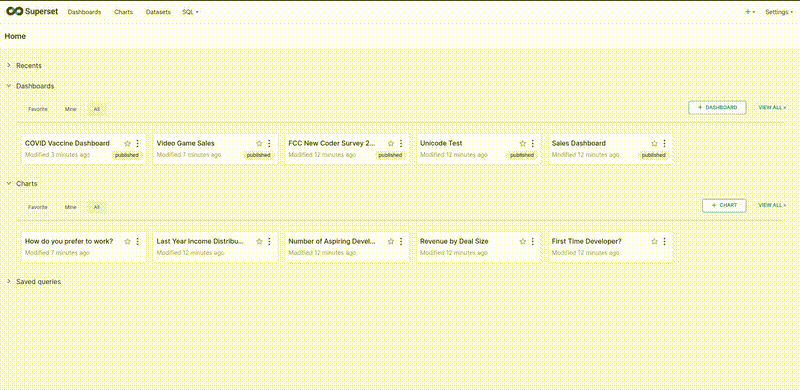

# superset-cluster


Resilient Business Intelligence.

* Survives multiple node failures, recovery mechanisms are integrated.
* No need for complex cluster management (e.g., Kubernetes).
* Security by default, data in transit encryption.
* Maintenance without downtime.
* Implements caching and parallel job execution for enhanced performance.



Follow [ARCHITECTURE.md](docs/ARCHITECTURE.md) for more.

## Requirements

### Hosts specification

* Images are built and tested specifically for `Ubuntu 22.04 x86_64` Linux platforms shipped with `Python v3.10.12`.
* Both `ssh` and `docker` services must be enabled by default on the nodes.
* Nodes must be able to resolve DNS names among themselves and communicate freely over the internal network,
  only port `443` should be exposed on the management nodes.
* The user's host must be able to connect to each of the nodes via SSH passwordlessly.
* Ability to read/write to the `/opt` directory on the nodes.
* At least one available and running network interface must be capable of sending and receiving packets
  between the user's host and management nodes via IPv4, IPv6 should be disabled or configured to be non-routable by default.

### Installed software

The following software needs to be installed on the user's host:

* `python v3.10.12` with the following third party packages:
  * `paramiko v3.5.0`

The following software needs to be installed on the external nodes:

* `ca-certificates v20230311ubuntu0.22.04.1`
* `containerd.io v1.6.31-1`
* `curl v7.81.0-1ubuntu1.16`
* `docker-buildx-plugin v0.14.0-1~ubuntu.22.04~jammy`
* `docker-ce v5:26.1.0-1~ubuntu.22.04~jammy`
* `docker-ce-cli v5:26.1.0-1~ubuntu.22.04~jammy`
* `openssh-server v1:8.9p1-3ubuntu0.10`
* `python v3.10.12` with the following third party packages:
  * `docker v7.1.0`

## Usage

To set up superset cluster with two management nodes and three MySQL nodes,
run `./superset-cluster` with the virtual IP address configured for the
specified available network interface. Use the following command as an example,
including the appropriate subnet mask for the default gateway:

```bash
./superset-cluster \
  --mgmt-nodes node1,node2 \
  --mysql-nodes node3,node4,node5 \
  --virtual-ip-address 192.168.1.100 \
  --virtual-network-interface eth0 \
  --virtual-network-mask 24
```

For more information, run `./superset-cluster --help`.

Navigate to `https://<virtual-ip-address>` in your web browser. Use the default credentials to log in:

* Username: `superset`
* Password: `cluster`

Remember to change the default credentials after successfully logging in by going to _Settings > Info > Reset My Password_.

## Development

Set up the Terraform testing infrastructure for development, by navigating to the `./tests/setup` directory and running:

```bash
terraform init
terraform apply
```

Once the infrastructure is up and running, you can use the [Usage](#usage) command against it:

```bash
./superset-cluster \
  --mgmt-nodes node-0,node-1 \
  --mysql-nodes node-2,node-3,node-4 \
  --virtual-ip-address 172.18.0.10 \
  --virtual-network-interface eth0 \
  --virtual-network-mask 16
```

For more detailed information, please refer to [the testing guide](tests/TESTING.md).

## License

[Apache v2.0](LICENSE)

## Contributing

If you notice anything missing, spot a bug, or have an enhancement proposal,
feel free to open an issue with the appropriate label.
Pull requests are welcome. Please ensure that the tests are updated as necessary.

## Personal contact information

In case of any inquiries, please write an email to: _wjmaj98@gmail.com_

## Additional resources

* [What is Apache Superset?](https://superset.apache.org/docs/intro)
* [Chapter 23 InnoDB Cluster](https://dev.mysql.com/doc/refman/8.0/en/mysql-innodb-cluster-introduction.html)
* [Redis OSS and Stack](https://redis.io/docs/latest/operate/oss_and_stack/)
* [NGINX Reverse Proxy](https://docs.nginx.com/nginx/admin-guide/web-server/reverse-proxy/)
